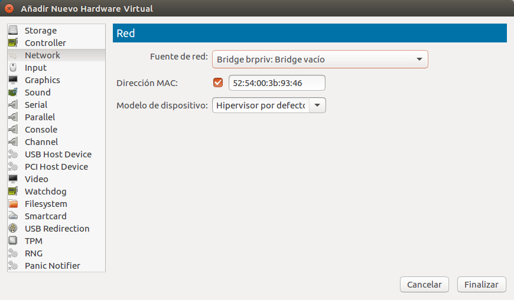

# Instalación Básica de OpenNebula

En nuestro caso, la instalación básica de la plataforma que vamos a utilizar consiste en dos partes: por un lado, instalación de la plataforma de laboratorio que vamos a utilizar y, por otro, la instalación de OpenNebula en sí mismo.

---
> **NOTA:** Puesto que el documento tiene un ancho limitado, para identificar cuando un salto de línea no es tal (en las líneas de código o la ejecución de comandos), éstos aparecerán destacados sobre fondo gris y los números de línea de cada bloque a la izquierda. De esta forma, podremos identificar si una línea es continuación de la anterior porque no tendrá número de línea.

## Instalación de la plataforma del laboratorio

El caso de la plataforma nos vendrá habitualmente dado por la instalación de nuestro cluster en nuestra organización. En el curso nosotros vamos a instalar una plataforma de pruebas compuesta por un equipo front-end y un working node. Ambos tendrán Ubuntu 16.04 y estarán conectados por las siguientes redes:
- una red de control, que llamaremos br-control y que tendrá IPs en el rango 192.168.0.1/24. Esta red se utilizará para realizar tareas de control de los nodos y nos permitirá comunicarlos entre ellos mediante SSH.
- una red privada, que llamaremos brpriv y que tendrá IPs en el rango 10.10.0.1/24. Esta red se utilizará para alojar máquinas virtuales. 
- una red con IPs públicas, que llamaremos brpub y que tendrá IPs en el rango 158.42.0.0/16. Esta red se utilizará para conectarnos a internet.

El esquema del laboratorio es el siguiente:


### Instalación del nodo físico (onenode01)

#### Actualización del sistema

Partimos de una instalación básica de Ubuntu 16.04, que actualizaremos y a la que instalaremos una serie de utilidades que vamos a necesitar para realizar la configuración:

```bash
$ apt-get update
$ apt-get -y dist-upgrade
$ apt-get install -y bridge-utils
```

#### Creación y configuración de las redes

Una vez tenemos esto listo, realizaremos la configuración de red de la plataforma, creando las distintas redes que vamos a necesitar. 

En primer lugar, deberemos averiguar qué interfaz tiene una IP pública en nuestra máquina. Para ello, ejecutaremos el comando ```ifconfig``` y buscaremos el interfaz que tiene la IP pública (el que tiene 158.42.x.x), que en nuestro caso es _enp3s0_.


Una vez conocido este dado, editaremos el fichero _/etc/network/interfaces_, teniendo en cuenta que deberemos sustituir el interfaz que hemos encontrado en el paso anterior donde pone _enp3s0_.

```
auto lo
iface lo inet loopback

auto br-control
iface br-control inet static
address 192.168.0.1
netmask 255.255.255.0
bridge_ports none

auto brpriv
iface brpriv inet static
address 10.10.0.1
netmask 255.255.255.0
bridge_prots none

auto brpub
iface brpub inet dhcp
bridge_ports enp3s0
pre-up iptables-restore < /etc/iptables.up.rules
```

En este momento, tenemos las redes creadas pero desde las redes privadas no tendremos salida a Internet. Por lo que deberemos hacer la instalación del _router_ público de nuestra red. Para ello, prepararmos el fichero _/etc/iptables.up.rules_ con el siguiente contenido:

```
*nat
-A POSTROUTING -s 192.168.0.0/24 ! -d 192.168.0.1/24 -o wlo1 -j MASQUERADE
COMMIT
*filter
-A FORWARD -d 192.168.0.0/24 -i wlo1 -o br-control -m state --state RELATED,ESTABLISHED -j ACCEPT
-A FORWARD -s 192.168.0.0/24 -i br-control -j ACCEPT
COMMIT
```

Este fichero contiene unas reglas de _iptables_ que permitirán que el equipo implemente un _router_ desde las IPs en el rango 192.168.0.0/24 hacia Internet, a través de la red _brpub_. Las modificaciones que hemos introducido en el fichero _/etc/network/interfaces_ hacen que, cuando se ponga en funcionamiento la red pública, se ponga en funcionamiento esta funcionalidad de router.

#### Configuración de los nombres de las máquinas

A continuación ajustaremos el fichero _/etc/hosts_, añadiendo las entradas de los nombres de máquinas que vamos a utilizar en nuestro laboratorio:

```
192.168.0.1 onenode01
192.168.0.2 onefront00
```

También modificaremos el fichero _/etc/hostname_ para que contenga el nombre de nuestro nodo:

```bash
$ echo "onenode01" > /etc/hostname
```

#### Reinicio de la máquina
Una vez establecida la configuración de la máquina, deberemos reiniciar y verificar que tenemos conectividad de red hacia el exterior, haciendo un ping a una web conocida. Por ejemplo, con el siguiente comando:


#### Instalación del servidor NFS
Para almacenar las imágenes de discos necesitamos un equipo que actue como una NAS (_Network Attached Storage_). Para el laboratorio, vamos a hacer que este equipo sea el mismo nodo físico, pero con que responda ante otro nombre, para que podamos separar la funcionalidad. En este caso, será _nfsserver_.

Lo primero que haremos será modificar el fichero _/etc/hosts_ incluyendo la siguiente línea:

```
192.168.0.1 nfsserver
```

A continuación, instalaremos los paquetes necesario para crear el servidor NFS y prepararemos un directorio, que será el que estará compartido a través de la red, entre las máquinas que forman la plataforma de virtualización (_onefront00_ y _onenode01_):

```bash 
$ apt-get install -y nfs-kernel-server nfs-common
$ mkdir -p /srv/var/lib/one
```

Para que quede compartido mediante el protocolo NFS, tendremos que incluir la siguiente línea en el fichero _/etc/exports_.

```
/srv/var/lib/one 192.168.0.1/24(rw,sync,no_subtree_check,no_root_squash)
```

Y para que los cambios surtan efecto, reiniciaremos el servicio _NFS_:

```bash
$ service nfs-kernel-server restart
```

Queremos que el directorio _/srv/var/lib/one_ esté compartido entre las distintas máquinas. Es importante ajustar los permisos para que el futuro usuario _oneadmin_ pueda escribir en ese directorio, porque ese directorio será el _home_ de _oneadmin_. En la instalación por defecto de ONE, el usuario _oneadmin_ tendrá el identificador _9869_, por lo que ejecutaremos el siguiente comando:

```bash
$ chown -R 9869:9869 /srv/var/lib/one/
```


### Instalación del nodo front-end
El nodo que va a hacer la función de front-end será una máquina virtual. Para ello, disponemos de una imagen de disco con Ubuntu 16.04.3 recién instalado, con el nombre de fichero _ubuntu-16.04.4.20G.qcow2_. En caso de que no se dispusiera de ella, se pueden seguir las instrucciones del Anexo I para generar la imagen de disco y volver a este punto.

#### Creación de la máquina virtual
De momento trabajaremos en el equipo físico (_onenode01_), hasta que tengamos la máquina virtual creada.

En primer lugar, moveremos el fichero _ubuntu-16.04.4.20G.qcow2_ al directorio ```/var/lib/libvirt/images``` y le daremos permisos de lectura y escritura universales (en una instalación en producción deberíamos hacer un ajuste de estos permisos, pero para el caso que nos ocupa utilizaremos estos permisos universales):

```bash 
mv ubuntu-16.04.4.20G.qcow2 /var/lib/libvirt/images
chmod 777 /var/lib/libvirt/image/ubuntu-16.04.4.20G.qcow2
```

Una vez listo, deberemos iniciar la aplicación _virt-manager_ ejecutando el comando ```virt-manager``` y nos aparecerá la siguiente imagen.

.

En esta aplicación deberemos pulsar el botón de crear una nueva máquina, con la figura  y nos aparecerá la siguiente figura.

.

Seleccionaremos la opción _Importar imagen de disco existente_ y pulsaremos en _Adelante_, para que nos permita entrar en la pantalla de selección del disco que se utilizará en la MV.


Aquí pulsaremos el botón "Explorar" y nos mostrará el contenido de los repositorios de imágenes, en una pantalla como la siguiente.


En concreto, nos muestra el repositorio por defecto, que se encuentra ubicado en la ruta _/var/lib/libvirt/images_, y que es donde hemos guardado la imagen que vamos a utilizar. Por tanto, deberá aparecer y nosotros procederemos a seleccionarla y pulsar _"Elegir volumen"_. Esto nos llevará a la siguiente pantalla, y en ella selecionaremos que el tipo de Sistema Operativo (SO) es _"Linux"_, y que la versión es _"Ubuntu 16.04"_. Nos quedará como la siguiente pantalla.


Una vez conseguida esta situación, pulsaremos el botón "Adelante" y nos mostrará la siguiente pantalla de selección de la cantidad de memoria virtual y CPUs que vamos a dedicar a la MV.


En nuestro caso vamos a seleccionar que queremos 1024 MB y 1 Core, puesto que son recursos suficientes para nuestra máquina. Una vez establecidos los valores, pulsaremos el botón "Adelante" y nos mostrará la siguiente pantalla.


En esta pantalla indicaremos el nombre de la MV (_onefront00_) y marcaremos las opciones de _"Personalizar configuración antes de instalar"_, e indicaremos que la red que queremos utilizar es la del puente _br-control_. Una vez hecho esto, pulsaremos el botón _"Finalizar"_ y llegaremos a la siguiente pantalla:


Aquí pulsaremos el botón _"Agregar hardware"_ y nos mostrará una pantalla como la siguiente, en la que deberemos seleccionar que la "fuente de red" es el bridge privado _brpriv_. Para el modelo del dispositivo, dejaremos el _"Hipervisor por defecto"_ y pulsaremos _"Finalizar"_.

.

Estas acciones nos dejarán una configuración como la que se muestra en la siguiente imagen, que será la que estábamos buscando.

.

En este momento podremos pulsar el botón _"Iniciar la instalación"_ y si todo ha ido correctamente, la máquina comenzará a arrancar como se muestra en la siguiente figura.

.

#### Configuración de la red en la Máquina virtual
Una vez termine de arrancar la máquina, tendremos que configurar la red de la misma.

Por el momento, tendremos que hacer la configuración desde la consola que nos ofrece _virt-manager_ ya que no podemos acceder a la máquina virtual de otra forma.

Para empezar, deberemos averiguar el nombre de los interfaces de red que tenemos en la máquina, con el comando ```ip link```, que nos mostrará una salida similar a la de la siguiente figura:


En este caso, los nombres son _ens3_ y _ens4_. Con estos nombres, tendemos que editar el fichero _/etc/network/interfaces_ para que quede el siguiente contenido (ajustando los nombres, de acuerdo a los obtenidos):

```
auto lo
iface lo inet loopback

auto ens3
iface ens3 inet static
address 192.168.0.2
netmask 255.255.255.0
gateway 192.168.0.1
dns-nameservers 8.8.8.8

auto ens4
iface ens4 inet static
address 10.10.0.202
netmask 255.255.255.0
```

Ahora ajustaremos el contenido del fichero _/etc/hosts_, añadiendo las siguientes líneas:

```
192.168.0.1 onenode01 nfsserver
192.168.0.2 onefront00
```

Y finalmente, estableceremos el nombre de la máquina, ejecutando el siguiente comando:

```bash
$ echo "onefront00" > /etc/hostname
```

En este momento deberemos reiniciar la máquina, y ya tendrá una configuración de red válida para nosotros.

Para verificar el funcionamiento, accederemos a _onefront00_ mediante SSH y haremos un _ping_ a una máquina exterior, como en el ejemplo:


## Instalación de OpenNebula
Una vez tenemos lista la _plataforma física de virtualización_ (* en el laboratorio estamos sustituyendo el nodo principal por una máquina virtual), podemos proceder a la instalación de OpenNebula (en adelante, _ONE_).

### Instalación del front-end (onefront00)

Puesto que ya tenemos configurada la red, podremos acceder a _onefront00_ por SSH para hacer la instalación del front-end.

Para comenzar, tendremos que añadir el repositorio de ONE, ejecutando los siguientes comandos:

```bash
$ wget -q -O- https://downloads.opennebula.org/repo/repo.key | apt-key add -
$ echo "deb https://downloads.opennebula.org/repo/5.4/Ubuntu/16.04 stable opennebula" > /etc/apt/sources.list.d/opennebula.list
```

Una vez añadidos, puesto que hemos indicado un repositorio con url https, tendremos que instalar el soporte https para apt:

```bash
$ apt-get install -y apt-transport-https
```

A continuación deberemos actualizar los paquetes disponibles en el sistema, ejecutando el comando siguiente:

```bash
$ apt-get update
```

Verificaremos que ONE se va a instalar desde los servidores de _downloads.opennebula.org_, con el comando ```apt-cache madison opennebula```, que debería darnos una salida en la que constara expresamente el servidor de _downloads.opennebula.org_, como en la siguiente figura:


Si todo está correcto, podremos proceder a la instalación de ONE, ejecutando el comando siguiente:

```bash
$ apt-get install -y opennebula opennebula-sunstone opennebula-gate opennebula-flow
```

Una vez instalados estos paquetes, deberemos completar la instalación con la ejecución del siguiente comando (aceptando las preguntas que nos haga):

```bash
$ /usr/share/one/install_gems
```

### Instalación del nodo de virtualización (onenode01)
Una vez instalados los paquetes en el nodo principal, vamos a instalar los paquetes necesarios en el nodo de virtualización.

Empezaremos añadiendo los repositorios de ONE, como hicimos en el servidor, ejecutando los siguientes comandos:

```bash
$ wget -q -O- https://downloads.opennebula.org/repo/repo.key | apt-key add -
$ echo "deb https://downloads.opennebula.org/repo/5.4/Ubuntu/16.04 stable opennebula" > /etc/apt/sources.list.d/opennebula.list
```

Una vez añadidos, instalaremos el soporte https para _apt_ y actualizaremos los paquetes del sistema:

```bash
$ apt-get install -y apt-transport-https
$ apt-get update
```

Finalmente instalaremos el único paquete que es necesario para un nodo de virtualización, ejecutando el comando siguiente:

```bash
$ apt-get install -y opennebula-node
```

### Integración con el sistema de ficheros compartido

Disponer de un sistema de fichero compartido en ONE nos vendrá bien por distintos motivos. El motivo más evidente es que, de esta forma, podemos tener algo equivalente a un sistema NAS en nuestro laboratorio, para poder seguir el curso.

Además será mucho más sencilla la instalación y administración de ONE, puesto que el directorio _home_ del usuario _oneadmin_ estará disponible en todos los equipos y esto nos facilitará el acceso _ssh sin contraseña_.

Pero de forma general, en cualquier instalación de ONE nos interesará disponer de un sistema de ficheros compartidos para poder utilizar características como _migración en vivo_. Para hacer uso de esta funcionalidad, el sistema de ficheros compartido es un requisito ineludible.

Para poder integrarnos con el sistema de archivos compartidos _nfsserver_, que hemos instalado anteriormente, deberemos añadir la siguiente línea al fichero _/etc/fstab_ tanto de _onefront00_ como de _onenode01_:

```bash
nfsserver:/srv/var/lib/one      /var/lib/one    nfs     soft,intr,rsize=8192,wsize=8192
```

Para darle el contenido inicial al directorio, iniciaremos una sesión SSH en _onefront00_ y ejecutaremos los siguientes comandos:

```bash
$ mv /var/lib/one /var/lib/one.local
$ mkdir /var/lib/one
$ mount /var/lib/one
$ cd /var/lib/one.local/
$ cp -r .one .ssh * /var/lib/one/
```

Una vez hecho todo esto, reiniciaremos los dos equipos. Hay que tener en cuenta que _en nuestro caso particular_, tendremos que apagar primero _onefront00_ puesto que es virtual. Después podremos reiniciar _onenode01_. Finalmente poner en marcha de nuevo _onefront00_, abriendo _virt-manager_, seleccionando la máquina en la consola y pulsando el botón _"play"_, como en la figura siguiente:


Para verificar que efectivamente ha funcionado la integración, podemos iniciar una sesión mediante SSH en _onefront00_ y ejecutar el comando ```mount | grep nfsserver```. La salida debe contener una línea en la que se indican los parámetros de conexión a la unidad compartida, y debe ser similar a la de la siguiente figura.


También deberemos repetir la operación en _onenode01_ para comprobar que tenemos el directorio montado correctamente.

> **NOTA:** Podemos hacer una comprobación adicional, que consistiría en, como usuario _oneadmin_, escribir un fichero en el directorio _/var/lib/one_ en _onefront00_ y comprobar que efectivamente aparece en el directorio _/var/lib/one_ de _onenode01_.

### SSH sin Contraseña entre los nodos
Un requisito para ONE es que el usuario _oneadmin_ debe poder hacer _ssh sin contraseña_ desde el front-end a los nodos. En nuestro caso, será desde _onefront00_ a _onenode01_.

En principio, esto debería estar funcionando porque el directorio _home_ de _oneadmin_ está compartido entre los equipos y la instalación de ONE prepara el acceso sin contraseña. Sin embargo, deberemos verificarlo y para ello iniciaremos una sesión en _onefront00_, cambiaremos al usuario _oneadmin_ y haremos _ssh_ a _onenode01_.

Si todo ha ido correcto, deberíamos encontrarnos en una situación como la de la figura siguiente:


Si alguno de los pasos anteriores falla, deberemos repasar la instalación y conseguir que el usuario _oneadmin_ pueda hacer _ssh sin contraseña_ desde _onefront00_ a _onenode01_.

> **NOTA:** Si tenemos un fichero $HOME/.ssh/id\_rsa.pub, el _ssh sin contraseña_ se coneguiría copiando ese fichero a $HOME/.ssh/authorized\_keys. También es importante revisar que el propietario de la carpeta $HOME/.ssh sea el usuario _oneadmin_.

Para evitar que al conectar a un nodo de la plataforma nos solicite guardar su _fingerprint_ ssh, crearemos el fichero _$HOME/.ssh/config_ con el siguiente contenido:

```bash
Host 192.168.0.* one*
StrictHostKeyChecking no
UserKnownHostsFile=/dev/null
```

Lo que conseguimos con este fichero es confirmar que la red de control es confiable y que las máquinas existentes en ella están controladas.

## Inicio de ONE
El primer inicio de ONE es bastante importante, puesto que determinará la clave del usuario administrador de la plataforma.

El administrador de la plataforma es el usuario _oneadmin_. Este usuario existe tanto como _usuario linux_ como _usuario ONE_.

Las credenciales de los usuarios linux para usar ONE desde la línea de comandos se encuentran en el fichero _$HOME/.one/one_auth_. El contenido de ese fichero es _<usuario_one>_:_<clave_one>_. Un ejemplo es el de la siguiente figura:


Deberemos asegurarnos de que ese fichero existe, con el propio usuario _oneadmin_ arrancaremos el demonio ONE utilizando el comando siguiente:

```bash
$ one start
```

Además deberemos poner en funcionamiento el cliente gráfico de ONE, con el siguiente comando:

```bash
$ sunstone-server start
```

Si todo ha ido correctamente, podremos ejecutar el comando ```onevm list``` y ver que efectivamente contactamos con el servidor.

Lo ocurrido debería ser similar a la siguiente imagen:


Ahora podremos acceder, utilizando un navegador, a la dirección _http://onefront00:9869_ y nos debería aparecer la página principal del cliente web _Sunstone_:


Aquí podremos hacer _login_ utilizando el usuario _oneadmin_ y la clave que aparece en el fichero _$HOME/.one/one_auth_. En el caso del ejemplo anterior, la clave sería _Sadej4bladIf_.