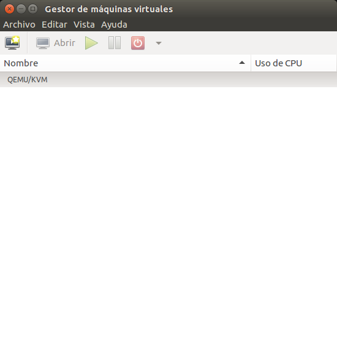
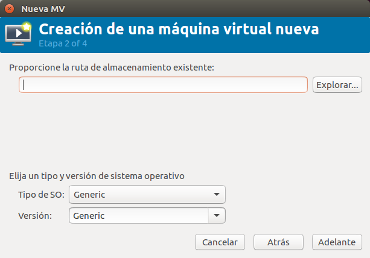
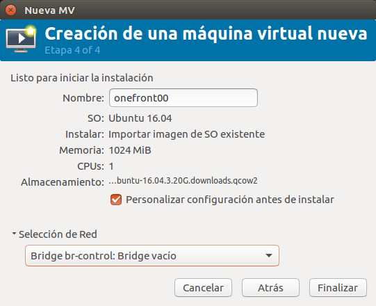

# Instalación del nodo onefront00

En este documento se describe, paso a paso, la instalación del nodo _onefront00_ utilizado en el curso "_OpenNebula_" ofertado por el _UFASU_ de la Universidad Politécnica de Valencia, en Octubre de 2017-

> En adelante se asume la existencia de un fichero de imagen de disco _ubuntu-16.04.4.20G.qcow2_. En caso de que no se dispusiera de ella, se pueden seguir las instrucciones del Anexo I para generar la imagen de disco y volver a este punto.

> También se asume la existencia de un bridge _br-control_ y otro _brpriv_, y que la máquina deberá tener las direcciones IP 192.168.0.2 (en br-control) y 10.10.0.202 (en brpriv).

En primer lugar, moveremos el fichero _ubuntu-16.04.4.20G.qcow2_ al directorio ```/var/lib/libvirt/images``` y le daremos permisos de lectura y escritura universales (en una instalación en producción deberíamos hacer un ajuste de estos permisos, pero para el caso que nos ocupa utilizaremos estos permisos universales):

```bash 
# usuario root
mv ubuntu-16.04.4.20G.qcow2 /var/lib/libvirt/images
chmod 777 /var/lib/libvirt/image/ubuntu-16.04.4.20G.qcow2
```

Una vez listo, deberemos iniciar la aplicación _virt-manager_ ejecutando el comando ```virt-manager``` y nos aparecerá la siguiente imagen.

.

En esta aplicación deberemos pulsar el botón de crear una nueva máquina, con la figura  y nos aparecerá la siguiente figura.

.

Seleccionaremos la opción _Importar imagen de disco existente_ y pulsaremos en _Adelante_, para que nos permita entrar en la pantalla de selección del disco que se utilizará en la MV.



Aquí pulsaremos el botón "Explorar" y nos mostrará el contenido de los repositorios de imágenes, en una pantalla como la siguiente.


En concreto, nos muestra el repositorio por defecto, que se encuentra ubicado en la ruta _/var/lib/libvirt/images_, y que es donde hemos guardado la imagen que vamos a utilizar. Por tanto, deberá aparecer y nosotros procederemos a seleccionarla y pulsar _"Elegir volumen"_. Esto nos llevará a la siguiente pantalla, y en ella selecionaremos que el tipo de Sistema Operativo (SO) es _"Linux"_, y que la versión es _"Ubuntu 16.04"_. Nos quedará como la siguiente pantalla.


Una vez conseguida esta situación, pulsaremos el botón "Adelante" y nos mostrará la siguiente pantalla de selección de la cantidad de memoria virtual y CPUs que vamos a dedicar a la MV.


En nuestro caso vamos a seleccionar que queremos 1024 MB y 1 Core, puesto que son recursos suficientes para nuestra máquina. Una vez establecidos los valores, pulsaremos el botón "Adelante" y nos mostrará la siguiente pantalla.

{width=50%}

En esta pantalla indicaremos el nombre de la MV (_onefront00_) y marcaremos las opciones de _"Personalizar configuración antes de instalar"_, e indicaremos que la red que queremos utilizar es la del puente _br-control_. Una vez hecho esto, pulsaremos el botón _"Finalizar"_.


