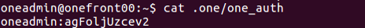
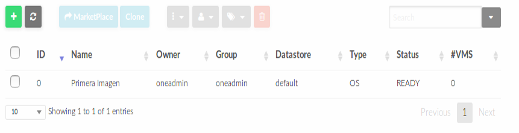
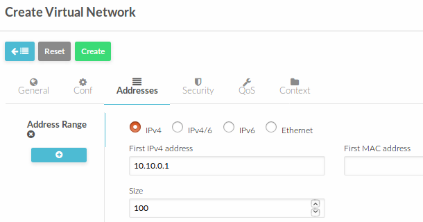
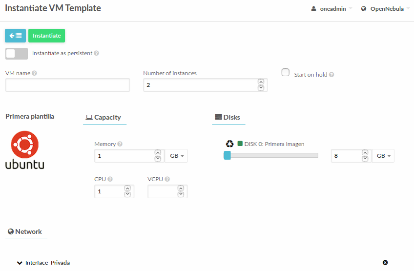

# Operación Básica de OpenNebula

## Antes de continuar...

Tanto _virt-manager_ como _OpenNebula_ utilizan _VNC_ para proporcionar acceso a la consola de las MV. Esto tiene un pequeño problema en nuestro laboratorio y es que ambos tratarán de utilizar el puerto por defecto de _VNC_ en la máquina física (el 5900). Evitar este problema, que derivará en el hecho de que nos aparecerán errores y no podremos acceder a la consola de las MV desde ONE, podemos configurar este último para que utilice otros puertos.

La forma de hacerlo consiste en editar el fichero _/etc/one/one.conf_ y actualizar el valor de la variable *VNC_PORTS* para que utilice un puerto por encima del 5900. La modificación quedará de la siguiente forma:

```bash
VNC_PORTS = [
    START    = 5900
#    RESERVED = "6800, 6801, 6810:6820, 9869"
]
```

## Verificación del funcionamiento de ONE

Tenemos que asegurarnos de que ONE está funcionando. Para ello, podremos ir a la consola de _onefront00_ y ejecutar los comandos ```service opennebula status``` y ```service opennebula-sunstone status```. La salida deberá ser similar a las siguientes:


En caso de que se encuentren detenidos, deberemos activarlos para que se pongan en funcionamiento automáticamente al arrancar el sistema, ejecutando los siguientes comandos (como root):

```bash
$ systemctl enable opennebula.service
$ systemctl enable opennebula-sunstone.service
```

Y posteriormente deberemos ponerlos en marcha

```bash
$ systemctl start opennebula.service
$ systemctl start opennebula-sunstone.service
```

En cualquier momento que hagamos modificaciones en el archivo de configuración de ONE o alguno de sus componentes, deberemos reiniciar el demonio de ONE (si hemos modificado el puerto _VNC_ en el primer apartado, deberemos reiniciar ONE):

```bash
$ systemctl restart opennebula
```

## Acceso a ONE

Hay dos mecanismos principales de acceso a ONE: la línea de comandos (CLI) y el interfaz web Sunstone.

El mecanismo por defecto es el CLI, y el interfaz web es un interfaz adicional que nos permitirá realizar la mayoría de funcionalidades, pero no todas. En adelante utilizaremos preferentemente Sunstone, puesto que es más sencillo y más visual; sin embargo, en ocasiones utilizaremos el CLI para acceder a funcionalidad adicional o de forma más inmediata.

### Credenciales

Las credenciales de acceso a ONE se encuentran en un fichero que viene indicado en la variable de entorno *ONE_AUTH*. En caso de que ésta no esté definida en el sistema, el valor por defecto es *$HOME/.one/one_auth*.

Al instalar ONE se crea en el sistema un usuario linux _oneadmin_, que contiene las credenciales de administrador (también _oneadmin_) de la plataforma ONE. Para este usuario se generan aleatoriamente unas credenciales de acceso, que quedarán almacenadas en el fichero *$HOME/.one/one_auth*. 



Esta clave la podremos modificar más adelante tanto en el interfaz Sunstone como en el CLI.

## Acceso a Sunstone

El acceso a Sunstone estará en el puerto 9869 del nodo fron-end. Así que en nuestro caso podremos abrir un navegador y acceder a la URL http://onefront00:9869 para acceder a Sunstone:

.

Ahí accederemos utilizando el usuario _oneadmin_ y la clave del fichero *$HOME/.one/one_auth*. Esto nos llevará a la pantalla principal de Sunstone:


La estructura de Sunstone es muy sencilla:

- En la parte de la izquierda se encuentran los distintos subsistemas junto con los objetos que se pueden manejar acerca de ellos: Instancias (Instances), Plantillas (Templates), Almacenamiento (Storage), Red (Network), Hosts y clusters (Infrastructure), Usuarios y grupos (System) y Preferencias (Settings).
- En la parte principal tendremos el detalle del objeto que estemos manejando en cada momento, con una parte superior en la que habrá una botonera de controles y la parte principal en la que se mostrará una lista de objetos o los detalles de uno en concreto.
- En la parte superior derecha contaremos con un acceso rápido a las preferencias del usuario.

## Creación de una Imagen de MV

Una imagen de MV es un _disco_ que puede utilizar una MV. Habitualmente será un disco virtual en el que, con un hipervisor, habremos realizado la instalación de un sistema, pero también podría ser un volcado de un disco (utilizando la herramienta _dd_ de linux).

Resulta esencial que cualquier MV cuente con, al menos un disco, desde el cual realizar el arranque.

ONE mantiene un catálogo de Imágenes de Máquinas Virtuales (VMI), que consiste en un conjunto de discos que podremos conectar a las MV.

Para crear un disco deberemos, en el menú de la izquierda, ir al apartado _Storage > Images_. Ahí veremos que, inicialmente la lista de imágenes aparece vacía. En este momento, podremos pulsar el el botón "+" de la parte central para iniciar el proceso de creación de una imagen.


Esto lanzará una pantalla como la siguiente:


En esta pantalla deberemos rellenar los datos esenciales de la imagen:

- Nombre de la imagen, que será el nombre que aparezca en la lista de imágenes y deberá servirnos para identificar el contenido.
- Tipo de imagen, que podrá ser "Sistema operativo", "CDROM" o "Datablock". Para que un disco pueda ser utilizar para arrancar, deberá der de tipo "Sistema operativo".
- La ruta donde el servidor podrá obtener la imagen (podrá ser un path en el servidor o un recurso en red como http, ftp, etc.). En nuestro caso será http://onefront00:9869/ubuntu-16.04.3.vmi.qcow2.
- Y en el apartado de "Advanced Options" podremos seleccionar otros aspectos importantes, como el formato del disco de origen. En nuestro caso, deberemos seleccionar que el tipo es "qcow2".

Una vez introducidos los datos necesarios, podremos pulsar el botón "Create" y aparecerá la lista de imágenes, con nuestra imagen recién creada en estado "LOCKED":


Ese estado indica que el servidor ONE está tratando de obtener la imagen y copiándola al almacén de VMIs (Datastore). Una vez haya descargado la imagen de disco, veremos que si todo ha ido bien, ésta pasa a estado "READY"



Una vez hecho esto, podremos pulsar sobre ella y ver el estado de la imagen y sus propiedades:


Ahí podremos consultar quien es el propietario, el tipo de imagen, etc. Incluso podremos cambiar sus propiedades, como el tipo de imagen, habilitarla o deshabilitarla, etc.

## Creación de una plantilla (template)

Para crear una MV tendremos que indicar qué características va a tener: CPU, Memoria, discos que tendrá conectados, redes a las que estará conectada, etc.

Por lo general, se suele trabajar con tipos de MV que tienen características similares en lugar de trabajar máquina por máquina. ONE considera que todas las MV tienen que ser creadas a partir de una plantilla de MV (_template_) y por ello, para crear una MV concreta deberemos crear antes un template. Podemos ver un _template_ como una _clase_ en el contexto de programación, y las MV concretas, como _instancias_ de esas clases.

Para crear un template deberemos ir al apartado _Template > VM_ del menú de la izquierda. Ahí nos mostrará la lista de templates en el sistema (actualmente vacía):


Ahí podremos pulsar el botón "+" para añadir un nuevo template y se nos mostrará la siguiente pantalla para proceder a su creación:


### Datos generales del Template

En primer lugar nos aparecen los datos generales del template, en donde deberemos indicar los datos básicos que identifiquen las MV que se puedan crear a partir de él:

- Nombre del template, que nos deberá servir para reconocer el tipo de máquina que es y las características que nos va a proporcionar.
- Hipervisor en el que va a esta basado (KVM o vCenter), que en nuestro caso es KVM. El sistema podrá soportar otros hipervisores, pero deberemos indicarlos en la línea de comandos, o con el interfaz avanzado de creación de templates.
- Memoria, que indica la cantidad de memoria asignada a la MV.
- CPU, que indica el porcentaje de CPU asignado a la MV (100% indica 1 core, con lo que podremos indicar, por ejemplo, valores como 200% para referirnos a 2 cores).
- VCPU, que indica la cantidad de CPUs virtuales que se van a ver desde dentro de la MV.

Podremos personalizar otros aspectos, como el logotipo de la imagen (relacionado con el S.O. instalado), etc.

### Discos del template

Una vez indicados los valores, deberemos pulsar en el botón "Storage", en la parte superior de los detalles del template, para que nos muestre la lista de discos disponibles:


En este apartado podremos indicar los discos que va a tener conectados una MV creada a partir de este template. En nuestro caso, seleccionaremos el "Disco 0" y en la lista marcaremos la imagen recién creada.

> *NOTA:* Con el botón "+" azul podremos añadir nuevo discos, pero de momento no vamos a necesitar hacerlo.

### Consola de acceso a las MV

Tras indicar los discos, deberemos asegurarnos de que tenemos un mecanismo de acceso s las MV. Para ello, pulsaremos el botón "Input/Output" en la parte superior de los detalles del template y nos aparecerá una pantalla como la siguiente:


Ahí deberemos asegurarnos de que seleccionamos al menos la consola VNC escuchando en _0.0.0.0_ y que el juego de caracteres es "es". En otro caso, podríamos encontrarnos con las teclas cambiadas de sitio, en función de la configuración por defecto de VNC.

## Creación de la primera MV

Una vez tenemos un template disponible, podemos proceder a la creación de una MV a partir de él. Para ello, iremos a la lista de templates (*Templates > VM*) y mostrar los detalles del template que acabamos de crear:


Pulsaremos el botón "Instantiate" de la botonera superior y nos mostrará la pantalla siguiente:


Aquí tendremos que darle el nombre que queramos utilizar para las máquinas virtuales, el número de MV que queremos crear a partir del template y modificar todas aquellas características que consideremos (y nos permita el template). En nuestro caso indicaremos que queremos crear una máquina, puesto que es nuestra primera prueba y no tiene más interés que el validar que funciona. 

> **NOTA:** en caso de que solicitásemos crear más de una, ONE le añadirá el sufijo -\<número de secuencia\>. Por ejemplo, si fuera MV y solicitásemos dos, ONE creará las máquinas con nombre _MV-0_ y _MV-1_. En caso de que no indiquemos nombre de template, ONE utilizará como nombre de la máquina _\<nombre template\>-\<ID ONE\>_.

Una vez personalizada la creación de las MV podremos pulsar el botón "Instantiate" y ONE se encargará de iniciar el proceso de creación de la MV.

Ahora pulsaremos el botón "_Instances_ > _VMs_" del panel de la izquierda, para que nos muestre la lista de MV creadas:


Como podemos ver, la instancia se ha creado y se encuentra en estado _PENDING_. Esto quiere decir simplemente que ONE tiene constancia de que se ha solicitado la creación de la MV, pero que aún no ha realizado ninguna acción al respecto.

Cuando el planificador decida en qué nodo debe alojarse la MV, ésta pasará a estado _PROLOG_, que significa que se están preparando los discos que van a estar conectados en la MV (en nuestro caso, se están copiando al nodo).

Si todo ha ido correctamente, la MV pasará por estado _BOOT_ y acabará en estado _RUNNING_. Este es el estado en el que la MV ya está puesta en funcionamiento.


En este momento, podremos pulsar el botón que parece una pantalla, en la parte derecha de la lista de MV, que nos mostrará la consola VNC de la MV.


En estos momentos, podremos entrar dentro de la MV y revisar que efectivamente está funcionando correctamente, comprobar sus características, etc.

## Creación de una Red

La disponer de MV sin red en una plataforma IaaS no tiene mucho sentido, puesto que serán MV aisladas a las que no podremos acceder de ninguna forma (en el caso anterior sí, a través de la consola VNC, pero puede no resultar práctico puesto que no podemos instalar paquetes, descargar, etc.).

ONE maneja el concepto de _redes virtuales_, que no son más que la definición de un conjunto de direcciones (IP, IPv6, Ethernet, etc.). Las MV podrán estar conectadas a estas redes virtuales, y ONE les asignará alguna de las direcciones disponibles.

Es importante tener en cuenta que ONE considera las redes como un elemento _legacy_ y por tanto, simplemente llevará un seguimiento de la asignación de direcciones a las MV. La asignación efectiva de las redes y su configuración se tienen que hacer por mecanismos externos a ONE (por ejemplo, _DHCP_). ONE proporciona cierto soporte a la configuración de la red mediante el _proceso de contextualización_, que se verá más adelante.

> **NOTA:** el hecho de que ONE considere las redes como un elemento _legacy_ hace que la integración sea más compleja y delicada, con muchos parámetros que configurar.

Para definir una red, tendremos que ir al apartado *Network > Virtual Network*, del panel de la izquierda. Ahí se nos mostrará la lista de redes disponible (actualmente vacía):


Para crear una red, deberemos pulsar el botón "+" del panel superior. Entonces ONE nos mostará la siguiente pantalla:


### Datos generales de la ted

En esta primera pantalla, simplemente le daremos un nombre a la red, que sirva para que el usuario pueda identificarla (y conocer qué tipo de acceso tendrá a la red). Posteriormente, pulsaremos el botón "Conf" para que nos muestre la siguiente pantalla:


Como hemos comentado anteriormente, ONE proporciona un mecanismo de red de tipo _legacy_. Por tanto, deberemos indicar el tipo de red que vamos a utilizar y el dispositivo físico al que las MV se deben conectar. En nuestro caso, tenemos el bridge _brpriv_ que hemos preparado para las MV, y el modo de red será _Bridged_, puesto que esta es una red básica. En la parte inferior del tipo de red ONE muestra un texto que trata de explicar la funcionalidad que va a proporcionar el tipo seleccionado.

### Direcciones en la red

Como también hemos comentado, una red virtual es un conjunto de direcciones. Así que deberemos pulsar el botón "Addresses" para definir dicho conjunto de direcciones:



Aquí tendremos que crear todos los segmentos de red que va a abarcar esta red específica. Si tuvieramos un servidor _DHCP_ que tuviera asignación específica entre MAC y dirección IP, deberíamos dar de alta uno a uno los pares IP-MAC. Sin embargo, en este momento, simplemente vamos a dar de alta un rango de direcciones IP, para que ONE las vaya asignando de forma consecutiva a las MV que se vayan creando.

En nuestro caso, indicaremos que la primera dirección IP es _10.10.0.2_ (tenemos que tener cuidado, porque la dirección 10.10.0.1 la hemos asignado a _onenode01_ anteriormente). El rango de direcciones que podremos asignar será 99 (para que asigne desde la _10.10.0.2_ hasta la _10.10.0.100_).

### Datos de contextualización

Finalmente deberemos pulsar el botón _Context_, que nos llevará a la siguiente pantalla, en la que deberemos proporcionar información acerca del _gateway_ y el servidor _DNS_:


En nuestro caso, indicaremos que el router es el _10.10.0.100_ (más adelante ya veremos por qué), y que el servidor DNS es el _8.8.8.8_ (el estándar de _google_).

Una vez introducidos todos los parámetros, pulsaremos el botón "Create" para que nos devuelva a la lista de redes, en la que ya aparecerá nuestra nueva red recién creada.


## Modificación del Template para que utilice la red

Una vez hemos creado la red, podemos modificar la plantilla creada anteriormente, para que las MV que se creen en adelante estén conectadas a esta nueva red virtual (las MV ya lanzadas **no** estarán conectadas a esta red).

Para ello, iremos a la lista de plantillas (*Templates > VMs*) y pulsaremos sobre nuestro template para que nos muestre los detalles del mismo:


Aquí pulsaremos el botón "Update", que nos llevará al modo de edición del template. Ahí pulsaremos el botón "Network", que nos llevará a la siguiente pantalla


En esta pantalla tendremos que pulsar sobre "NIC 0" para indicar que queremos modificar el interfaz de red 0, y en la lista de redes seleccionaremos que queremos que esté conectado a la red "Privada", que es la que acabamos de crear. A continuación pulsaremos el botón "Update" para registrar los cambios.

## Creación de MVs conectadas a la red

Una vez modificado el template iremos a los detalles del mismo (*Templates > VM* y seleccionando nuestro template) y podremos pulsar el botón "Instantiate" para crear alguna MV a partir del template modificado, en una pantalla como la siguiente:



En nuestro caso, seleccionaremos que queremos instanciar 2 MVs y pulsaremos el botón "Instantiate".

Ahora iremos al listado de instancias de MV (*Instances > VMs*) y veremos que en la lista aparecen nuestras dos nuevas instancias:


La peculiaridad en este caso, frente al anterior es que en el campo "IPs" aparecerán las direcciones IP que ONE ha asignado a cada MV.

## Contextualización de la red en las MVs

Las MV se crean a partir de discos genéricos. Esto quiere decir que, si no se hace nada, todas las MV serán exactamente iguales puesto que tendrán el mismo contenido en los discos. Así que tendrán los mismos programas, usuarios, etc. Esto supone un problema puesto que dos usuarios distintos que creen una MV a partir de la misma VMI, podrían tener acceso a sus MV, pero también a las MV de los otros (puesto que conocerían las credenciales de acceso).

Esto es de particular importancia para el tema de la conexión a red. Si no existe un proveedor de direcciones IP externas (por ejemplo, un _servidor DHCP_), ocurriría que, o bien las MV no tendrían red (por no tener dirección IP), o bien que las hemos dejado configuradas con una IP determinada, con lo que todas tendrían la misma dirección IP. En cualquier caso, la red no sería útil.

Una MV es un _sistema opaco_ y por tanto, no es modificable desde el exterior. Por tanto, las MV tienen que pasar por un proceso de contextualización que consiste en aplicar la configuración particular de una MV a una plantilla general que es la VMI.

Hay sistemas como _cloud-init_ o _one-context_ que automatizan el proceso, apoyados por el gestor de la plataforma cloud (ONE). Esto implica que la VMI debe estar instrumentada con un paquete de software que, durante el arranque inicial, haga la configuración.

En nuestras MV tenemos instalado _one-context_ que está proporcionado por los desarrolladores de ONE para distintas plataformas y que se encarga de realizar esta configuración inicial.

Si comprobarmos la MV que hemos arrancado, veremos que hay un servicio _one-context_ que se encuenta en funcionamiento y, si vamos al directorio */etc/one-context.d* podremos ver que hay una serie de _scripts_ que son los que se ejecutan al arrancar la MV:


Este servicio confía en el soporte de ONE, que consiste en que, antes de arrancar la MV, prepara una imagen _ISO_ de un CDROM que contiene unos archivos que, a su vez, contienen variables que se pueden utilizar para configurar la MV y todos los datos adicionales necesarios para ello.

## Operaciones sobre MV y el Ciclo de Vida de las MVs

El ciclo de vida de las MV va más allá de los estados que hemos visto hasta el momento (_PENDING_, _PROLOG_, _BOOT_, _RUNNING_ y, eventuamente _FAILURE_ si nos ha fallado en algún momento).

El diagrama de estados por los que puede pasar una MV en ONE se muestra en la siguiente figura:


Como se puede ver, existen muchos estados por los que puede pasar una MV. Y la mayoría de ellos responden a la invocación de operaciones sobre ellas.

Las operaciones básicas que se pueden realizar sobre una MV son los que se indican en los siguientes apartados

### Terminate/Terminage Hard

Esta operación se utiliza para "apagar una MV de forma que ya no queramos utilizarla nunca más. Podremos generar otra MV a partir del mismo template y, eventualmente usar el mismo disco, pero esa MV (con su ID de MV) desaparecerán _para siempre_ de ONE. La terminación de la MV se puede hacer de dos formas: con ACPI (y soporte del Sistema Operativo) o sin él.

La operación _terminate_ envía la señal ACPI a la MV, pero si no está instalado el soporte de ACPI en ella, como ocurre en las máquinas físicas, no se apagará.

Como alternativa podemos ejecutar la operación _terminate hard_, que, intuitivamente, equivaldría a quitar la corriente de la MV.

### Reboot/Reboot Hard

Esta operación se utiliza para "reiniciar la MV utilizando el botón de _reset_".

Como ocurre en el caso anterior, ONE envía la señal de reset mediante ACPI a la MV pero puede que ésta no responda (porque esté colgada o porque no tenga soporte a ACPI).

Como alternativa, se puede ejecutar la operación _terminate hard_, que, intuitivamente, equivaldría a quitar la corriente de la MV y enchufarla de nuevo.

### Poweroff/Undeploy

Esta operación se utiliza para "apagar la MV con la intención de ponerla de nuevo en funcionamiento". Este es un caso equivalente a la operación _terminate_, sin que se elimine la MV del sistema. De esta forma, posteriormente podremos pulsar el botón "play" para volver a poner en marcha la MV.

Como en el caso _terminate_, tendremos la versión "_hard_" para aquellos casos en los que no tengamos soporte ACPI o que las MV no respondan.

La operación _poweroff_ deja la MV (y sus discos) en el mismo nodo en el que se econtraba, consumiendo recursos de cara a la planificación de otras MV. La diferencia con respecto a _undeploy_ es que esta última quita la MV del nodo y obliga a que se vuelva a replanificar como si nunca hubiera estado en marcha. Esto significa que, al poner en funcionamiento de nuevo una MV que ha pasado por _undeploy_, podrá acabar alojada en otro equipo físico distinto al que estuvo inicialmente.

### Suspend/Stop

Esta operación sirve para hacer un volcado de la MV a disco y detener su ejecución. Es similar al caso anterior, salvo por el hecho de que mientras en el caso anterior las MV pasaban por un proceso de apagado y encendido convencional, cuando una MV ha sido suspendida y posteriormente es restaurada, ésta continúa con las aplicaciones y su configuración en el estado en que estuviesen.

Estas herramientas dependen en gran medida del soporte que de el hipervisor. En este caso, _KVM_ cuenta con operaciones equivalentes, que son las que se ejecutan.

### Recover

Esta es en realidad una _pseudo-operación_ ya que en realidad se utiliza para corregir situaciones anómalas con las MV.

Esto es fácil de ver con un ejemplo. Supongamos que mandamos apagar una MV desde ONE, pero puede que no responda (por ejemplo,si se indica que se quiere apagar una MV pero no tiene ACPI). Para ONE, la MV se encontraría en un _estado transitorio_ que sería "apagando". Si nosotros entramos en la consola VNC de la MV veremos que en realidad la MV no se está apagando y, por tanto, nunca llegará a estar en el estado "apagado" que espera ONE.

En ese caso, tendríamos la opción de "recuperar" la MV, indicando que la última operación solicitada _no se ha ejecutado correctamente_, en cuyo caso, ONE la devolvería al estado anterior.

También puede ocurrir que una MV se haya apagado (por ejemplo, hemos ido al hipervisor y la hemos borrado "a mano"). ONE no la detectará y la marcará en estado _ERROR_ o _UNKNOWN_. En ese caso, nosotros deberíamos "recuperar" la MV, indicando que se ha borrado. ONE comprobará si quedan restos de la MV (por ejemplo, imágenes de discos en el nodo físico) y, en su caso, los eliminará.

### Otras operaciones

En las MV también podremos realizar otras operaciones como las siguientes:

- Añadir un nuevo dispositivo de red, en caso de que, por ejemplo, se nos hubiera olvidado conectar la MV a una red en concreto.
- Añadir un disco nuevo (a partir de una imagen existente o creando un disco en blanco específico para utilizar de forma temporal).
- Cambiar los recursos de la MV. Esto se utiliza para cambiar la cantidad de memoria o CPU asignadas a la MV e implica un apagado de la MV para que el sistema operativo reconozca las nuevas características.
- Migrar las MV entre nodos físicos. Por ejemplo para el caso en que necesitemos actualizar y reiniciar un equipo físico que tiene MVs alojadas en él. En estas circunstancias podremos mover temporal sus máquinas a otro equipo para dejarlo libre y poder reiniciarlo. La migración podrá ser "en vivo" u "offline", en función de la instalación de ONE (para migración _en vivo_ ONE necesita que los nodos físicos tengan acceso simultáneo a los discos, por ejemplo, con un _Datastore_ compartido). En el caso de la migración "en vivo" la ejecución de las MV no se verá afectada y podremos tener acceso a ellas en todo momento y sin interrupción apreciable.

## El CLI de ONE

Toda la funcionalidad que se puede hacer desde Sunstone se puede hacer desde la línea de comandos de linux, con las aplicaciones que instala ONE.

Si vamos al bash y tecleamos _one_ y pulsamos dos veces tabulador (para utilizar la característica de _autocompletion_ de bash), veremos la lista de comandos que tenemos a nuestra disposición:


Los comandos más habituales son ```onevm``` y ```onehost```, que nos servirán para gestionar el ciclo de vida de las MV y los _hosts_, respectivamente.