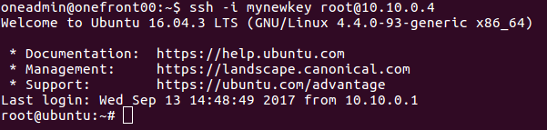

# Acceso a las MV por red

Hasta el momento, hemos visto que podemos acceder a las MV utilizando la consola VNC que nos proporciona el interfaz Sunstone de ONE. Al final del todo, este es un mecanismo muy sencillo que nos proporciona la experiencia equivalente a _estar delante del ordenador_. Sin embargo, una consola VNC en un navegador no resulta del todo funcional. Por ejemplo, al pulsar la tecla _Esc_, se cierra de forma automática la ventana que aloja la consola VNC y esto es de especial interrupción en caso de que estemos utilizando aplicaciones como el editor _vi_, que utiliza dicha tecla de forma frecuente.

Por otro lado, no puede ser admisible que en un entorno Cloud tengamos como único mecanismo de acceso a una MV el de disponer de una consola VNC y no contar con acceso mediante la red red. Es más, por defición de la tecnología Cloud, las MV deberían ser accesibles a través de Internet.

El método más habitual para acceder a una máquina Linux mediante Internet es el de iniciar una sesión remota mediante un cliente _SSH_ y vamos a asumir que todas las MV basadas en Linux que vayamos a desplegar en ONE van a contar con este tipo de acceso.

Una vez sabemos que podemos utilizar SSH, podríamos pensar que bastaría con crear una serie de usuarios y contraseñas en las VMIs y utilizarlos para acceder a las instancias. Sin embargo, esto es un problema de seguridad muy grave, puesto que si dos usuarios A y B crean instancias distintas, al conocer las contraseñas de las VMIs, tanto A podría acceder a las MVs de B (y por tanto, al contenido), como B a las de A.

En el Cloud se suele utilizar un mecanismo alternativo, que consiste en disponer de unos pares de clave pública y privada para acceder mediante SSH a las MV, sin contraseña. Para ello, los usuarios indican sus claves públicas y éstas se inyectan en las instancias durante el proceso de _contextualización_.

> **NOTA:** Hemos de pensar que el usuario que crea una MV es aquél que va a tener acceso a la misma. Posteriormente él ya hará la configuración de la MV y, eventualmente, se la entregará a otro usuario final. Lo importante es que el usuario que ha creado la instancia debe ser capaz de acceder a la MV para poder hacer la configuración inicial.

ONE proporciona soporte para gestionar estas claves públicas y facilitarlas al servicio one-context de la MV.

## Introducir la clave pública en el perfil del usuario

Para poder acceder a las MV sin contraseña necesitamos una clave pública y privada. En linux esto lo podemos hacer ejecutando el siguiente comando:

```bash
ssh-keygen
```

En nuestro caso, le daremos el nombre _mynewkey_ y dejaremos la contraseña en blanco. Esto nos generará un par de ficheros _mynewkey_ y _mynewkey.pub_. El proceso lo podemos ver en la figura:


Podremos consultar el contenido de la clave pública, que puede ser compartida con el resto de usuarios:


A continuación iremos a los _settings_ del usuario, y en la sección _Auth_ podremos incluir la clave pública, pulsando el recuadro junto al campo _Public SSH Key_. Ahí simplemente deberemos copiar el contenido de la clave pública vista anteriormente.


> **NOTA:** tendremos que tener mucha precaución en el momento de pegar la contraseña, evitando que se hayan introducido retornos de línea inesperados.

## Verificación de la clave pública

Para verificar que la clave pública se ha incluido correctamente en la información del usuario, deberemos crear un template de MV que incluya una imagen de disco que incorpore el paquete _onevm-context_ y que tenga acceso a la red privada. El último template que hemos creado nos valdrá para nuestro propósito.

Abriremos los detalles del template y seleccionaremos la sección "Context". Ahí nos aseguraremos de que está marcada la opción "Add SSH contextualizacion", como aparece en la siguiente figura:


Una vez actualizado, pulsaremos el botón "update", y crearemos una instancia de ese template.

Cuando la MV haya finalizado el arranque, anotaremos la dirección IP de la máquina (en nuestro caso, 10.10.0.4) e iremos a _onefront00_. Desde el directorio donde hemos generado la clave _mynewkey_ haremos _ssh_ como root a dicha IP, pero indicando que utilice como identidad el fichero de nuestra clave privada:

```bash
$ ssh -i mynewkey root@10.10.0.4
```

Si todo ha ido correctamente, el comando _ssh_ nos solicitará que aceptemos el _fingerprint SSL_ del nodo y entraremos sin necesidad de contraseña.




