# Drivers y Scripts

ONE está formado por una serie de subsistemas que permiten que se integre con la infraestructura física que se va a utilizar como plataforma de virtualización:

- Infrastructure Manager (IM), encargado de la gestión y monitorización de los equipos físicos.
- Virtual Machine Manager (VMM), que interacciona con el hypervisor y se dedica a la gestión del ciclo de vida de las MVs.
- Datastores, encargado de gestionar el backend de almacenamiento de las imágenes de máquinas virtuales.
- Transfer Managers (TM), que se utiliza para copiar las imágenes de máquinas virtuales desde los _datastores_ al nodo en el que se va a alojar efectivamente una MV.
- Virtual Networks (VNM), que se utiliza para realizar la integración con la red física existente.

Estos subsistemas se implementan por medio de unas aplicaciones o scripts que se encuentran en el directorio _/var/lib/one/remotes_ del front-end de ONE.

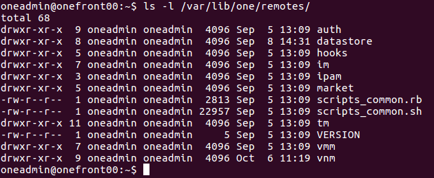

Posteriormente, ONE copia el contenido de este directorio a cada uno de los _hosts_, dejándolo en el directorio _/var/tmp/one_.

> **NOTA:** una buena práctica a la hora de modificar estos scripts consiste en realizar los cambios en el _front-end_ y posteriormente distribuir los cambios utilizando el comando _onehost sync_.

## Infrastructure Manager (IM)
El subsistema de integración con la infraestructura es el IM. Se encarga de obtener la información del estado de los nodos desde un punto de vista de la infraestructura: arquitectura, CPU libre, memoria libre, MV alojadas, etc.

Los distintos _drivers_ disponibles se encuentran en el directorio _/var/lib/one/remotes/im_.

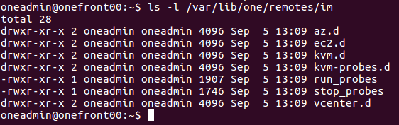

Existen distintos directorios, en función de los posibles hipervisores que se contemplan en ONE y básicamente lo que hace ONE es ejecutar el contenido del directorio _\<hipervisor\>.d_. Por ejemplo, para el caso de _kvm_, se ejecutan los scripts dentro de _kvm.d_.

En particular, para el caso de _kvm_, lo que se hace es utilizar un modelo de datos que acaba ejecutando los scripts del directorio _kvm-probes.d_ en los nodos que van a alojar las MVs. Así, en nuestro caso, en el nodo _onenode01_ se ejecutarán los scripts del directorio _kvm-probes.d_ (desde el directorio _/var/tmp/one/im/kvm-probes.d_).

Podemos probar los scripts y veremos que generan por la salida estándar líneas con el formato _CLAVE=VALOR_, que son los que ONE va a incorporar a su sistema de información. Algunos ejemplos son los siguientes:

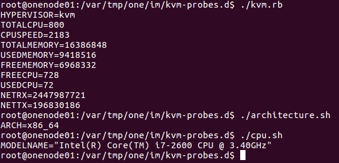

Entre otros, uno de los scripts, obtiene información acerca de las MV que están alojadas en el _host_ (_poll.sh_), y la información que se obtiene en esa monitorización es la que se incorporará al sistema de información de las MV utilizado en ONE.

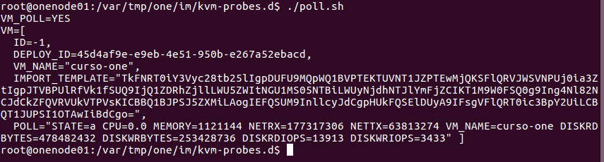

Las MV con el prefijo _one-_ son las que ONE considera propias, mientras que el resto se considera que son "piratas" (en las versiones actuales de ONE se puede realizar una _importación_ de MV lanzadas "a mano").

## Gestor de MV (VMM)

La gestión de MV se realiza mediante los plugins alojados en el directorio _/var/lib/one/remotes/vmm_ del front-end (directorio _/var/tmp/one/vmm_ en los nodos).

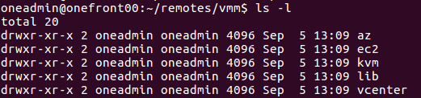

En particular, para el caso del hipervisor _kvm_ (que es en el que se enfoca el curso), vemos que hay una serie de scripts:

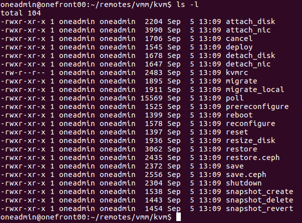

Esos scripts se pueden entender como _"el interfaz que ha de implementar un VMM para que pueda funcionar en ONE"_. De manera que, si queremos dar soporte a un nuevo hipervisor, bastaría con implementar un subconjunto de scripts con esos nombres y una semántica adaptada a ONE.

Por ejemplo, el script _deploy_ se utiliza para poner en funcionamiento una MV. Si revisamos el contenido, podemos ver lo siguiente

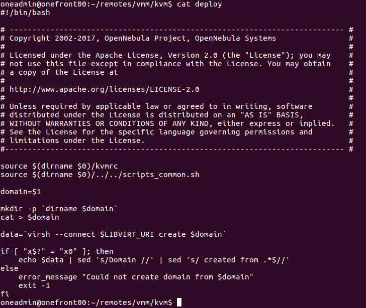

La clave de ese script es la línea que contiene el comando ```virsh --connect $LIBVIRT_URI create $domain```. Puesto que para crear una MV en KVM podríamos ejecutar el comando ```virsh create <domain>```, indicando un fichero de definición de la MV.

En el caso de _kvm_ para Linux, el comando principal para realizar la interacción es _virsh_. Así, si revisamos otros scripts como _shutdown_ veremos que en algún momento ejecuta un comando similar a ```virsh destroy ...``` o ```virsh shutdown ...```.

Para dar soporte a un hipervisor no sería necesario implementar _todos_ los scripts. Bastaría con implementar aquellos que nos dieran el soporte que necesitemos para nuestro hipervisor. Así, por ejemplo, si no vamos a poder añadir dispositivos de red teniendo la MV en funcionamiento, no será necesario implementar el script _attach\_nic_.

Algunos de los scripts se ejecutan en los siguientes momentos (es conveniente revisar el contenido de los scripts y la documentación oficial de ONE para conocer exactamente los parámetros que reciben y el momento de invocación):

- cancel, que se invoca en el momento que se quiere eliminar una MV.
- deploy, que se invoca para poner en funcionamiento una MV.
- attach_disk y attach_nic, que se ejecutan cuando se quiere añadir un disco o un dispositivo de red a una MV que está en funcionamiento.
- detach_disk y detach_nic, que se ejecutan cuando se desea quitar un disco o un dispositivo de red a una MV que está en funcionamiento.
- migrate, cuando se quiere mover una MV desde el host físico que la está alojando a otro.
- reboot, cuando se quiere reiniciar una MV utilizando las llamadas al sistema operativo.
- reset, cuando se quiere resetear una MV simulando un ciclo de corriente eléctrica.
- save, se llama cuando se quiere guardar el estado de una MV en un fichero para su posterior reanudación (al ejecutar la operación "pause" sobre una MV).
- restore, que se invoca para reanudar una MV que se hubiera parado anteriormente.
- ...

## Datastores

La interacción con los backends donde ONE almacena las imágenes de los discos que se pueden utilizar en las MV se realiza mediante un conjunto de scripts que se encuentran en el directorio _/var/lib/one/remotes/datastores_.

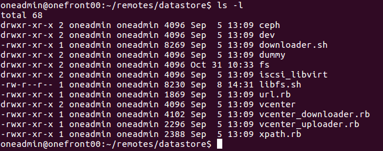

En particular, para el caso del hipervisor _fs_ (que es el que hemos utilizado en este curso), vemos que hay una serie de scripts:

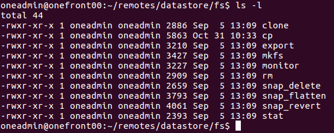

Esos scripts se pueden entender como _"el interfaz que ha de implementar un Datastore para que pueda funcionar en ONE"_. De manera que, si queremos dar soporte a un nuevo datastore, bastaría con implementar un subconjunto de scripts con esos nombres y una semántica adaptada a ONE.

Por ejemplo, el script _cp_ se utiliza para copiar una imagen de disco desde un archivo arbitrario (proporcionado por el usuario) al _datastore_.

Para dar soporte a un datastore no sería necesario implementar _todos_ los scripts. Bastaría con implementar aquellos que nos dieran el soporte que necesitemos para nuestro datastore. Así, por ejemplo, si no vamos a dar soporte a _snapshots_, no tendríamos por qué implementar los scripts *snap_delete*, *snap_flatten* o *snap_revert*.

Algunos de los scripts del interfaz son los siguiente (es conveniente revisar el contenido de los scripts y la documentación oficial de ONE para conocer exactamente los parámetros que reciben y el momento de invocación):

- clone, se utiliza para crear una copia de una VMI que ya está en el datastore.
- cp, se invoca para copiar una VMI desde un fichero proporcionado por el usuario al datastore.
- mkfs, se utiliza para crear una VMI de un tamaño determinado y que esté formateada utilizando un sistema de ficheros concreto.
- monitor, se utiliza para obtener el espacio libre en el datastore.
- rm, se utiliza para eliminar una VMI que está en el datastore.
- stat, se usa para comprobar el tamaño de una VMI.

## Transfer Managers (TM)

En términos de ONE, existe un datastore especial denominado _system_ que es aquel en el que estarán los discos utilizados en una MV que está en ejecución. Los _transfer managers_ se utilizan para copiar los discos desde un datastore de VMIs al datastore system del nodo que va a alojar la MV.

> **NOTA: ** Hay que tener en cuenta que existe un acoplamiento importante entre los _datastores_ y los _transfer managers_, por lo que será necesario revisar si son compatibles o no a la hora de utilizarlos. 

Los movimientos de fichero entre los datastores y el datastores "system" se realizan mediante un conjunto de scripts que se encuentran en el directorio _/var/lib/one/remotes/tm_.

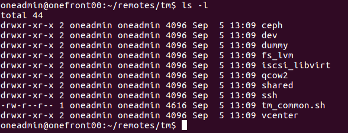

En particular, durante el curso hemos utilizado los _tm_ _shared_ y _ssh_. Si nos fijamos en el contenido del _tm_ _shared_ podemos ver que existen los siguientes scripts:

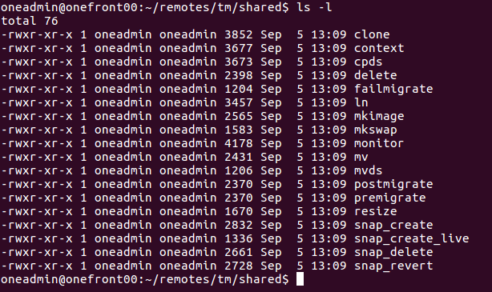

Esos scripts se pueden entender como _"el interfaz que ha de implementar un tm para que pueda funcionar en ONE"_. De manera que, si queremos dar soporte a un nuevo _tm_, bastaría con implementar un subconjunto de scripts con esos nombres y una semántica adaptada a ONE.

Por ejemplo, el script _ln_ se utiliza para copiar una imagen de disco desde un datastore _fs_ a un _datastore_ _system_ de tipo _fs_. En este caso, el _tm_ _shared_ asume que hay un sistema de ficheros compartidos, por lo que si revisamos el contenido de ese script, acaba ejecutándose el comando ```ln```.

Para dar soporte a un _tm_ no sería necesario implementar _todos_ los scripts. Bastaría con implementar aquellos que nos dieran el soporte que necesitemos para nuestro datastore. Así, por ejemplo, si no vamos a dar soporte a migraciones, no tendríamos por qué implementar los scripts _premigrate_ y _postmigrate_.

Algunos de los scripts del interfaz son los siguiente (es conveniente revisar el contenido de los scripts y la documentación oficial de ONE para conocer exactamente los parámetros que reciben y el momento de invocación):

- clone, se utiliza para hacer una copia de una VMI **no persistente** que está en un datastore al datastore system.
- context, se utiliza para generar una imagen ISO a partir de un conjunto de ficheros, y dejarla disponible en el datastore system.
- cpds, que se utiliza para copiar una VMI que está en el directorio system a otro datastore. Esta operación tiene sentido, por ejemplo, cuando hay que almacenar una imagen que era persistente y ha sido modificada por la MV en ejecución (y no había un vínculo directo con la imagen original; por ejemplo, en el _tm_ _ssh_ habrá que copiar la imagen persistente modificada al datastore original para que conste como modificada).
- delete, que se utiliza para eliminar una imagen del datastore system.
- ln, se utiliza para hacer una copia de una VMI **persistente** que está en un datastore al datastore system, de forma que quede vinculada a la imagen en el datastore original.
- monitor, se utiliza para comprobar el espacio disponible en el datastore system.
- mv, que se usa para mover una imagen desde el datastore al datastore system.
- mvds, se utiliza para mover una imagen desde el datastore system a un datastore que almacena VMI.
- ...

## Virtual Network Manager (VNM)

La integración de ONE con la infraestructura de red existente se realiza mediante los plugins alojados en el directorio _/var/lib/one/remotes/vnm_ del front-end (directorio _/var/tmp/one/vnm_ en los nodos).

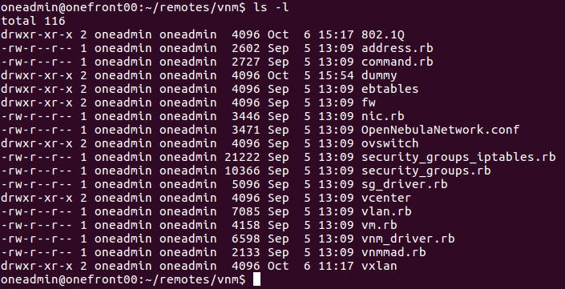

ONE no trata de hacer un control muy férreo de la red y en su lugar se integra con una serie de posibles tecnologías existentes. Al final, lo que necesita ONE es un _bridge_ al que conectar las MVs y, sobre él, en todo caso, realizar una serie de funciones. 

En particular, durante el curso hemos utilizado la red de tipo _briged_ que en ONE se implementa mediante el interfaz _dummy_. Sin emabrgo, en este caso ninguno de los scripts realiza ninguna función (todos se limitan a finalizar con estado _0_). Así que vamos a inspeccionar mejor el caso del driver _fw_, que implementaría el modelo _bridged con grupos de seguridad_:

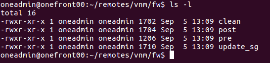

Esos scripts se pueden entender como _"el interfaz que ha de implementar un vnm para que se pueda utilizar en ONE"_. De manera que, si queremos dar soporte a un nuevo _vnm_, bastaría con implementar un subconjunto de scripts con esos nombres y una semántica adaptada a ONE.

Si nos fijamos en el contenido del contenido del script _post_ veremos que es el siguiente:

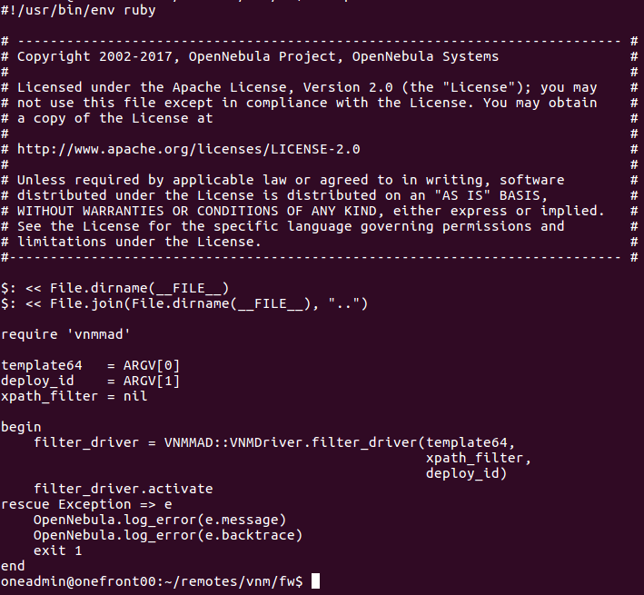

Si vamos tirando del código, acabaremos encontrando que se utiliza la clase ```SGDriver``` y que al activar crea unas reglas de _iptables_ correspondientes a los grupos de seguridad.

Para dar soporte a un _vnm_ será necesario implementar todos los scripts, aunque retornen sin realizar ninguna función. La función de cada script es la siguiente (es conveniente revisar el contenido de los scripts y la documentación oficial de ONE para conocer exactamente los parámetros que reciben y el momento de invocación):

- pre, se invoca antes de realizar la conexión de una MV a una red.
- post, se invoca tras realizar la conexión de la MV a una red.
- clean, se llama al desconectar la MV de una red.
- update_sg, se llama al actualizar los grupos de seguridad.
